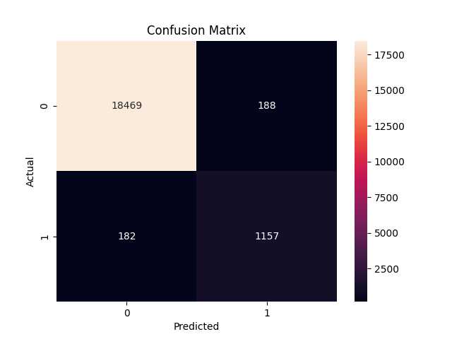
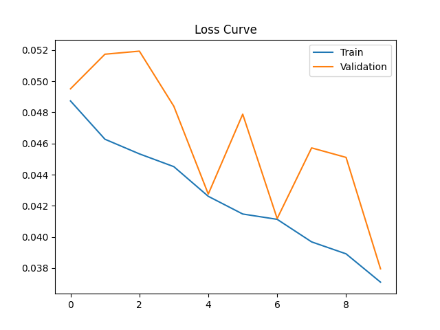

# Electrical Fault Detection Using CNN

## Overview
This project detects electrical faults using time-series power consumption data. A 1D Convolutional Neural Network (CNN) is used to identify abnormal patterns in electrical signals.

## Dataset
- UK-DALE dataset (HDF5 format)
- Power consumption readings
- Preprocessed and scaled for modeling

## Methodology
- Data cleaning and normalization
- Synthetic fault injection for anomaly simulation
- Sequence generation (window size = 20)
- 1D CNN model for classification

## Model Architecture
- Conv1D layers
- Global Average Pooling
- Dense layers
- Sigmoid output

## Results
- High accuracy (~99%)
- Strong precision and recall
- Effective fault detection capability

## Visualizations

### Confusion Matrix


### Loss Curve


## How to Run

```bash
pip install -r requirements.txt
python src/train.py
